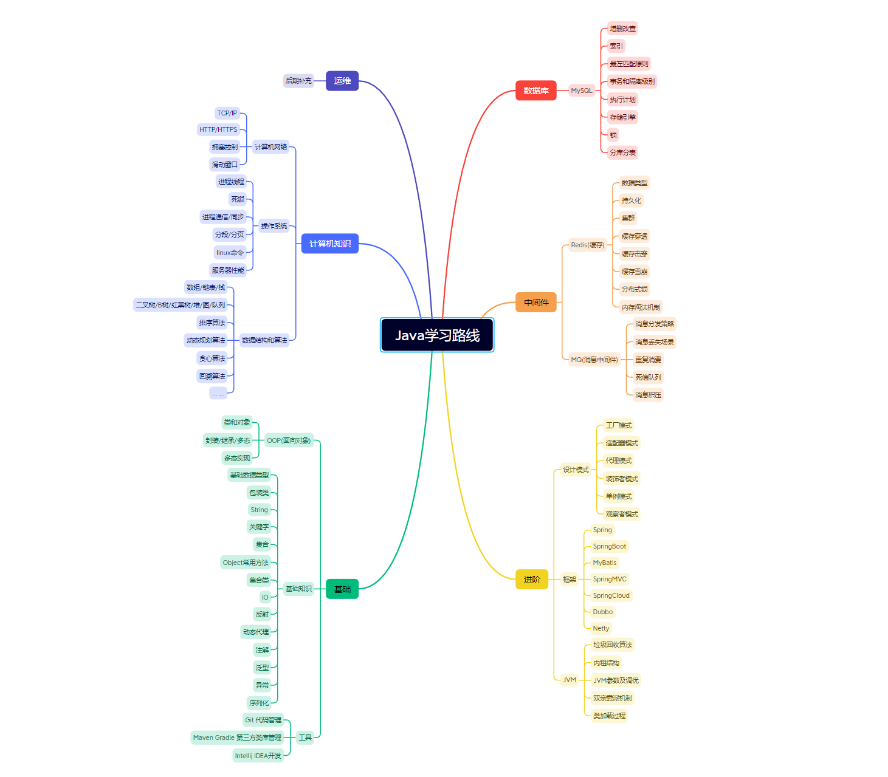

# interview-question
### 介绍：
#### 本项目是为了打卡自律，坚持学习而记录 初次看了时间：2023-11-17 00:28

# Java学习规划
* [学习路线图片看这里](pic/学习规划.png)




# 学习计划目录
* [学习计划目录看这里](markdowns/学习计划目录.md)


### md文件语法案例

>参考: https://markdown.com.cn/basic-syntax

#### 案例1 代码块
````
class Test {
 System.out.print("test");
}
````

``` puml
A -> B
```

```plantuml
digraph Test {
 A -> B
}
```

#### 案例2 md文件指向链接

说明：[* 空格] 表示目录的下一层数据结构

* [** About this Guide](markdowns/GUIDE.md)   **点击此链接跳转当前md文件**
1. About this Guide：超链接文本名称  
2. markdowns: 存放md文件的目录
3. GUIDE.md: 案例文件 


#### 案例3 md文件引用
语法： [> 空格] 表示文本引用超链接
eg:
> https://www.zhihu.com/tardis/zm/art/146611382?source_id=1005


#### 案例4 md内容 无序符号列表
语法： * 项目1 ： 在文字前加一个星号即可，星号和文字间有一个空格。 如果需要层级关系，那么每层按下Tab键缩进，在 * 项目1.1
* 项目1
  * 项目1-1
    * 项目1-1

